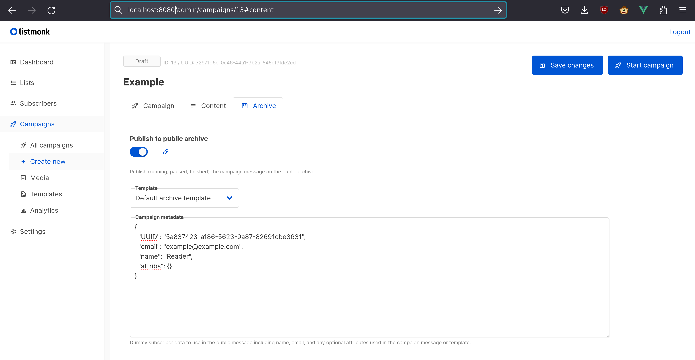

# 归档

在公共 Web 界面上维护一个全局公共归档。可以在设置 -> 设置 -> 常规 -> 启用公共邮件列表归档中启用它。

要使活动在公共归档中可用（假设已如上所述在设置中启用），请在活动 -> 创建新 -> 归档中启用"发布到公共归档"选项。

当使用依赖于订阅者数据的模板变量（例如任何引用 `.Subscriber` 的模板变量）时，此类数据必须作为"活动元数据"提供，这是一个 JSON 对象，将在渲染归档模板和内容时替代 `.Subscriber`。

当启用单个订阅者跟踪时，TrackLink 要求将现有用户的 UUID 作为活动元数据的一部分提供。从归档活动中点击 TrackLink 的任何点击都将计入该订阅者。

例如：

```json
{
  "UUID": "5a837423-a186-5623-9a87-82691cbe3631",
  "email": "example@example.com",
  "name": "Reader",
  "attribs": {}
}
```



