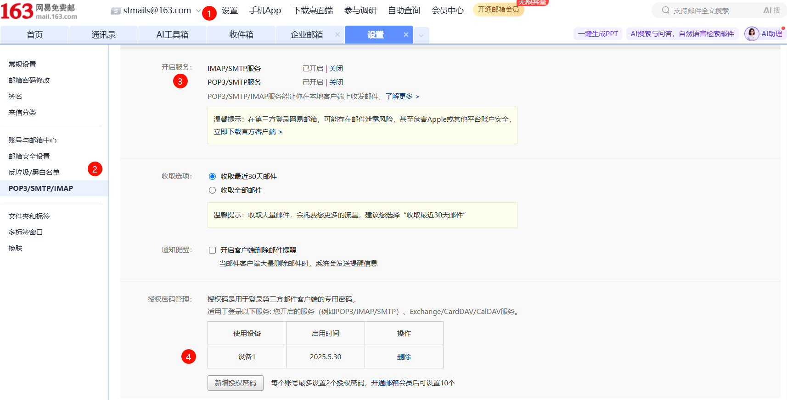
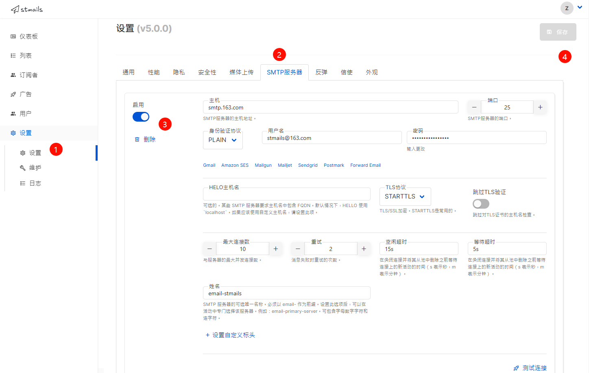
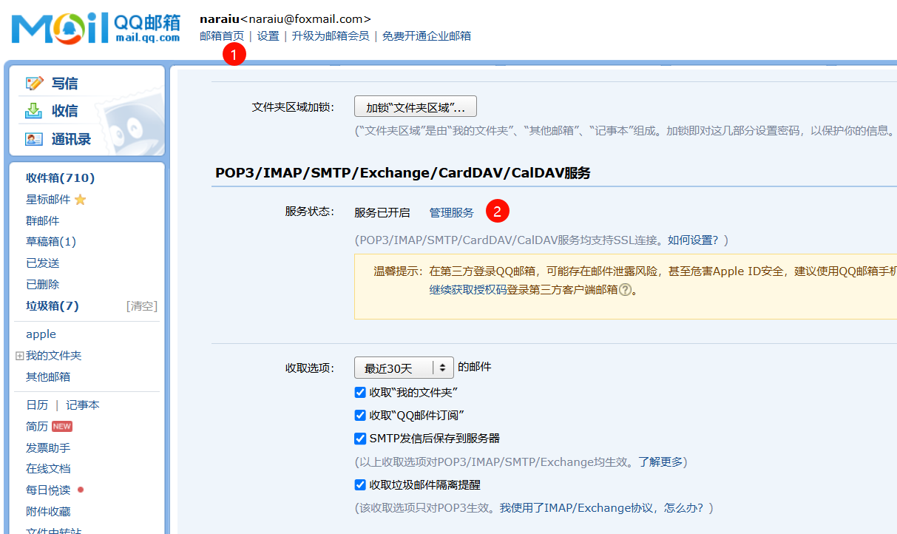
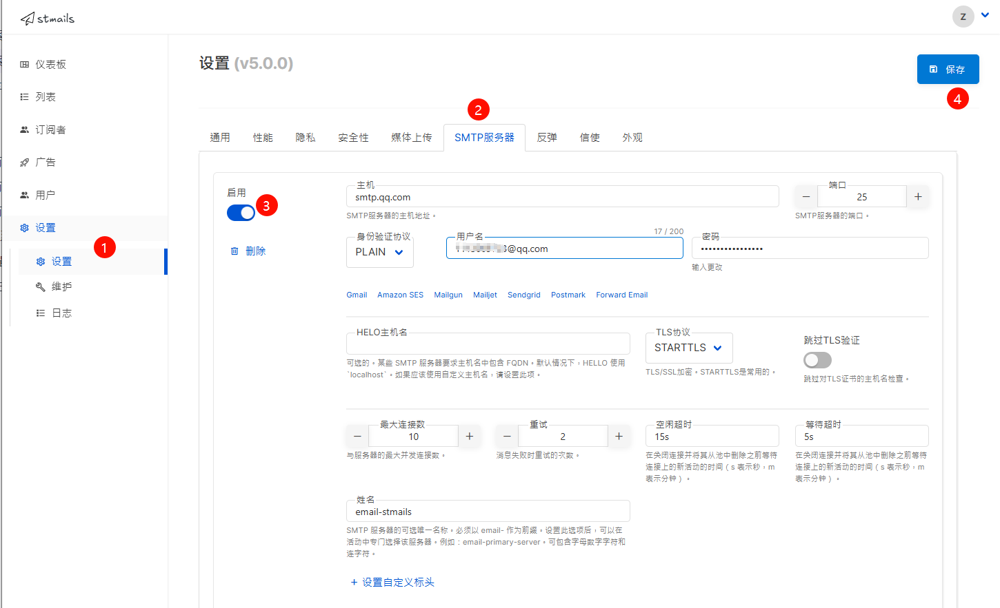
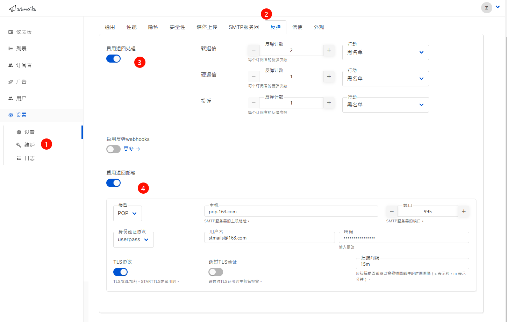
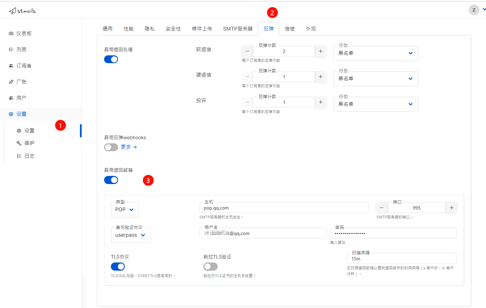

# 邮箱配置
## 发信邮箱配置
在`设置 -> SMTP服务器`下配置发信服务器。

### 163发信

1. 登陆[163邮箱](https://mail.163.com)，在`设置 -> POP3/SMTP/IMAP`下开启`IMAP/SMTP服务`和`POP3/SMTP`服务。在授权密码管理下新增一个授权密码，并保存。

2. 打开stmails找到`设置 -> SMTP服务器`下启用一个SMTP发信服务器。填写表单并保存

    > 主机：smtp.163.com 

    > 端口: 25 

    > 身份验证协议：PLAIN 

    > 用户名：你自己的163邮箱号 

    > 密码：163邮箱的授权码 

    > TLS协议：STARTTLS 

    

### qq发信

1. 登陆[qq邮箱](https://mail.qq.com)，在`设置 -> 账号 -> POP3/IMAP/SMTP/Exchange/CardDAV/CalDAV服务`下开启服务，生成授权密码，并保存。

2. 打开stmails找到`设置 -> SMTP服务器`下启用一个SMTP发信服务器。填写表单并保存

    > 主机：smtp.qq.com 

    > 端口: 25 

    > 身份验证协议：PLAIN 

    > 用户名：你自己的qq邮箱号 

    > 密码：qq邮箱的授权码 

    > TLS协议：STARTTLS 

    

## 退信邮箱配置
在`设置 -> 反弹`下配置退回邮箱

### 163退信
打开stmails找到`设置 -> 反弹`下启用邮件回弹功能。填写表单并保存

> 主机：pop.163.com 

> 端口: 995 

> 身份验证协议：userpass 

> 用户名：你自己的163邮箱号 

> 密码：163邮箱的授权码 

> TLS协议：启用 

### qq退信
打开stmails找到`设置 -> 反弹`下启用邮件回弹功能。填写表单并保存

> 主机：pop.qq.com 

> 端口: 995 

> 身份验证协议：userpass 

> 用户名：你自己的qq邮箱号 

> 密码：qq邮箱的授权码 

> TLS协议：启用 

