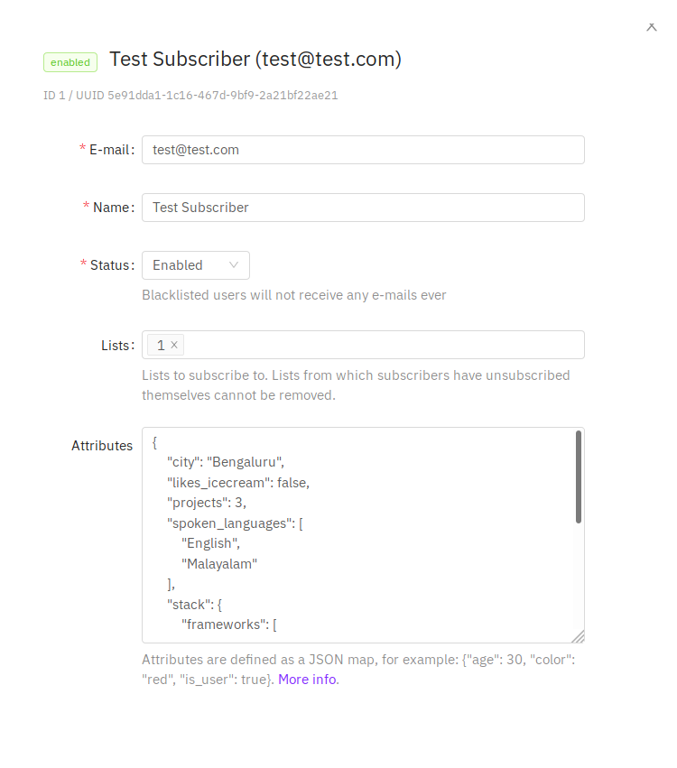
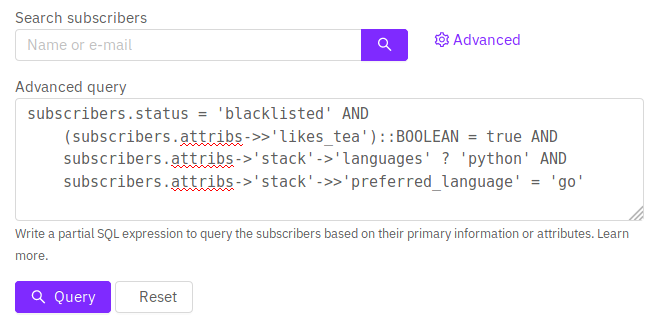

# 查询和细分订阅者

stmails 允许编写部分 PostgreSQL SQL 表达式来查询、过滤和细分订阅者。

## 数据库字段

以下是订阅者数据库中可查询的字段。

| 字段                    | 说明                                                                                         |
| ------------------------ | --------------------------------------------------------------------------------------------------- |
| `subscribers.uuid`       | 订阅者的随机生成唯一 ID                                                  |
| `subscribers.email`      | 订阅者的电子邮件 ID                                                                         |
| `subscribers.name`       | 订阅者的姓名                                                                              |
| `subscribers.status`     | 订阅者的状态（启用、禁用、黑名单）                                           |
| `subscribers.attribs`    | 以 JSON 表示的任意属性映射。通过 PostgreSQL 的 `->` 和 `->>` 运算符访问。 |
| `subscribers.created_at` | 订阅者首次添加时的时间戳                                                       |
| `subscribers.updated_at` | 订阅者被修改时的时间戳                                                          |

## 示例属性

以下是一个虚构订阅者的属性 JSON 映射示例。

```json
{
  "city": "Bengaluru",
  "likes_tea": true,
  "spoken_languages": ["English", "Malayalam"],
  "projects": 3,
  "stack": {
    "frameworks": ["echo", "go"],
    "languages": ["go", "python"],
    "preferred_language": "go"
  }
}
```



## SQL 查询表达式示例



#### 通过电子邮件查找订阅者

```sql
-- 精确匹配
subscribers.email = 'some@domain.com'

-- 部分匹配，查找以 @domain.com 结尾的电子邮件
subscribers.email LIKE '%@domain.com'
```

#### 通过姓名查找订阅者

```sql
-- 查找所有名字以 John 开头的订阅者
subscribers.email LIKE 'John%'
```

#### 多个条件

```sql
-- 查找所有被加入黑名单的 John
subscribers.email LIKE 'John%' AND status = 'blocklisted'
```

#### 查询查看了活动邮件的订阅者

```sql
-- 查找所有查看了活动邮件的订阅者
EXISTS(SELECT 1 FROM campaign_views WHERE campaign_views.subscriber_id=subscribers.id AND campaign_views.campaign_id=<put_id_of_campaign>)
```

#### 查询属性

```sql
-- ->> 运算符返回文本值。查找所有居住在 Bengaluru 且完成超过 3 个项目的订阅者
-- 这里将 'projects' 转换为整数，以便我们可以应用数值运算符 >
subscribers.attribs->>'city' = 'Bengaluru' AND
    (subscribers.attribs->>'projects')::INT > 3
```

#### 查询嵌套属性

```sql
-- 查找所有被加入黑名单、喜欢喝茶、会编写 Python 代码且偏好 Go 编程的订阅者
--
-- -> 运算符返回结构值。这里，"languages" 字段
-- ? 运算符检查列表中是否存在某个值
subscribers.status = 'blocklisted' AND
    (subscribers.attribs->>'likes_tea')::BOOLEAN = true AND
    subscribers.attribs->'stack'->'languages' ? 'python' AND
    subscribers.attribs->'stack'->>'preferred_language' = 'go'
```

要了解如何编写 SQL 表达式来对 JSON 属性进行高级查询，请参考 PostgreSQL 的 [JSONB 文档](https://www.postgresql.org/docs/11/functions-json.html)。
